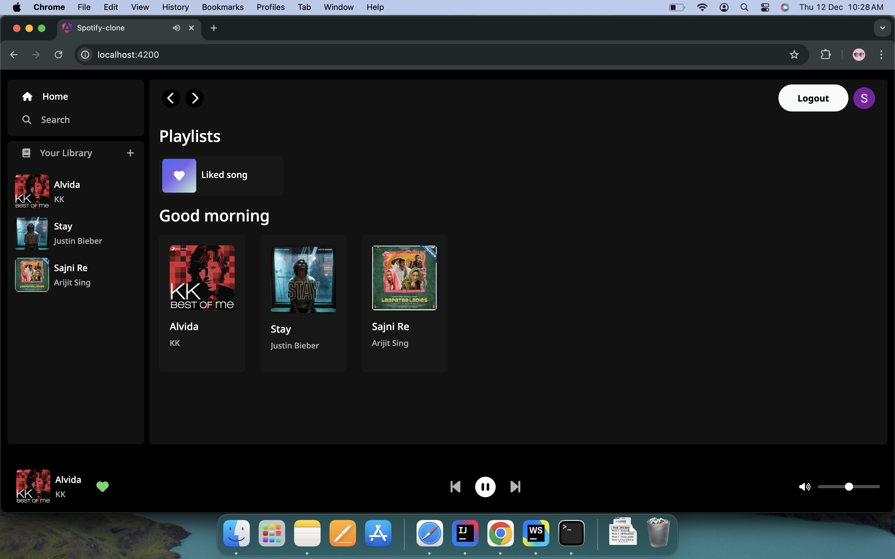
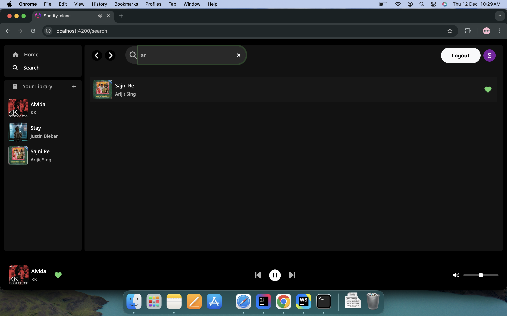
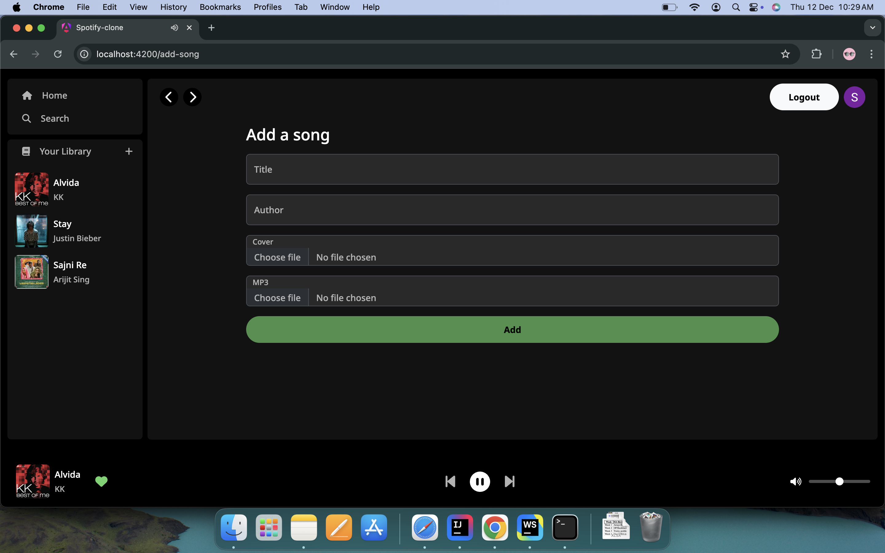
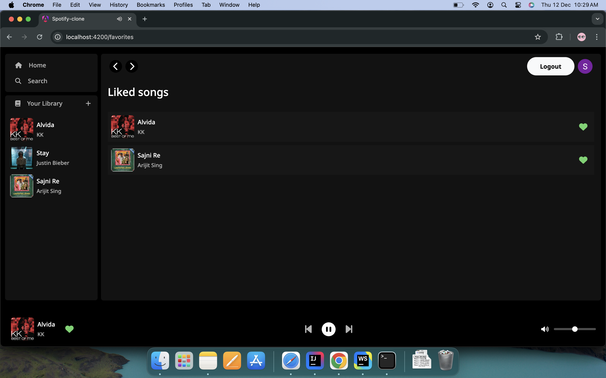

# Spotify Clone 🎵

A feature-rich Spotify-like music streaming application built to replicate the functionality and user experience of the Spotify platform.




---

## Features ✨

- **User Authentication**: Secure login and account management.
- **Music Library**: Browse a vast collection of songs by genre, artist, or album.
- **Playlists**: Create, edit playlists. Mark favorites on songs.
- **Streaming Player**: High-quality music streaming with playback controls.
- **Responsive Design**: Optimized for desktop and mobile.
- **Latest Angular features**: Signal, Standalone component, New Control flow syntax

---

## Tech Stack 🛠️

- **Frontend**: Angular
- **Backend**: Spring Boot (Maven-based)
- **Database**: PostgreSQL
- **Other Tools**: Secured with Auth0 (OAuth2)

---

## Installation 📥

### Backend Setup

1. **Navigate to the backend directory**:
   ```bash
   cd Spotify-clone/backend
   ```
2. **Build the project using Maven**:
   ```bash
   mvn clean install
   ```
3. **Run the application**:
   ```bash
   mvn spring-boot:run
   ```
4. The backend server should now be running at `http://localhost:8080`.

### Frontend Setup

1. **Navigate to the frontend directory**:
   ```bash
   cd Spotify-clone/frontend
   ```
2. **Install Angular dependencies**:
   ```bash
   npm install
   ```
3. **Run the Angular development server**:
   ```bash
   ng serve
   ```
4. The frontend application should now be accessible at `http://localhost:4200`.


## Contribution 🤝

1. Fork the repository.
2. Create a new branch:
   ```bash
   git checkout -b feature-name
   ```
3. Commit your changes and push:
   ```bash
   git push origin feature-name
   ```
4. Open a pull request.

---

## Screenshots 📸

Few samples to showcase application's interface:
- **Search Song**: 
- **Add Song**: 
- **Favorites/Playlist**: 
